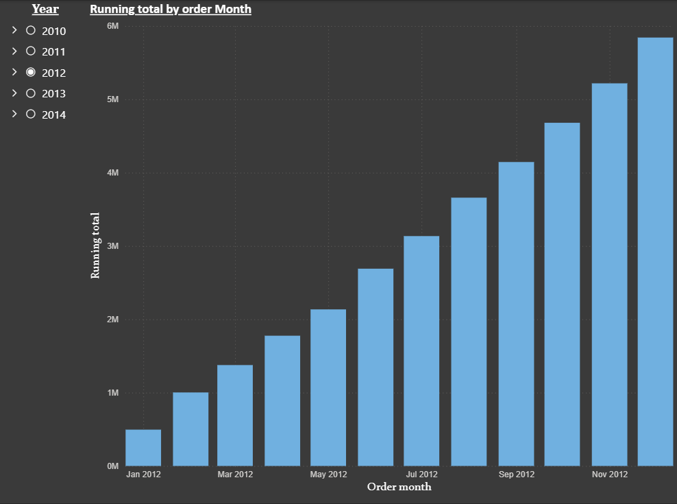
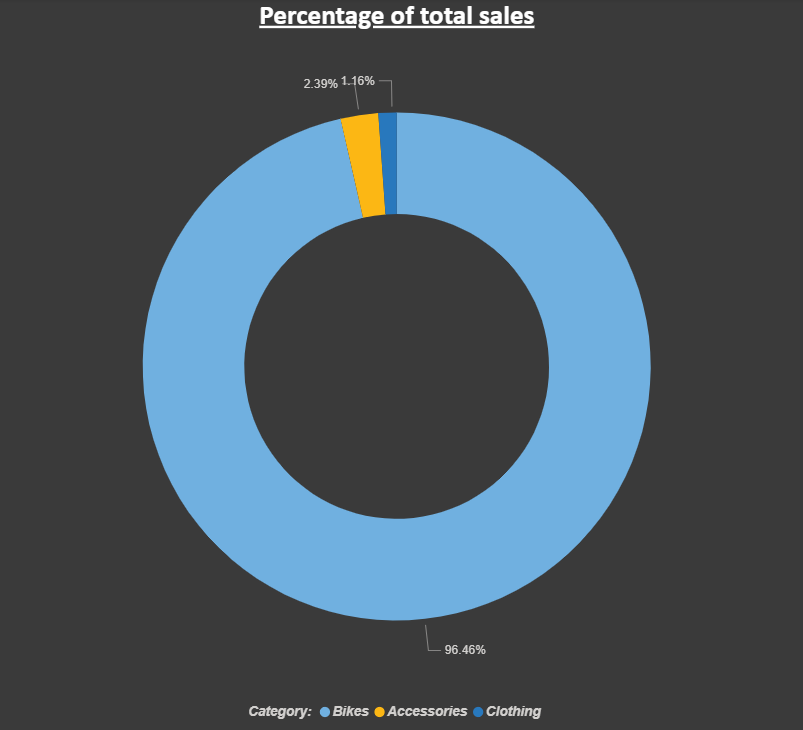
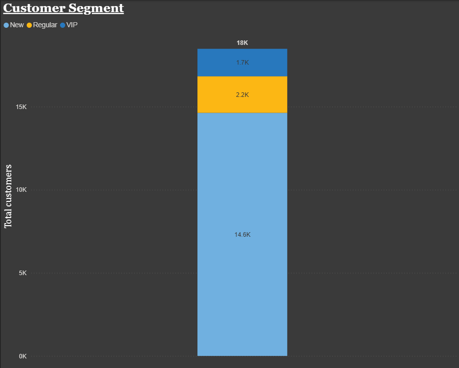

# SQL Analytics Project

A comprehensive sales and customer analytics project built using **Microsoft SQL Server** and visualized in **Power BI**. This project demonstrates real-world data analysis workflows including exploratory analysis, time-series trends, customer segmentation, and product performance evaluation.

---

## 📁 Project Structure

```
sql-analytics-project/
│
├── customer_report_view.sql       # Consolidated customer-level report view
├── customer_segment.sql           # Customer segmentation analysis (VIP, Regular, New)
├── Monthly_sales.sql              # Monthly and yearly sales trends
├── Performance_analysis.sql       # Year-over-year product performance analysis
├── Running_total.sql              # Cumulative monthly sales running total
├── Sales_percentage.sql           # Sales contribution by product category
│
├── Image/
│   ├── running_total.png
│   ├── customer_segment.png
│   └── sales_percentage.png
│
└── README.md
```

---

## 🗄️ Database

- **Platform:** Microsoft SQL Server 2025 Express
- **Database:** DataWarehouseAnalytics
- **Schema:** gold (dim_customers, dim_products, fact_sales)

---

## 📊 Analysis Sections

### 1. Monthly Sales Trends
Tracks total sales, customer count, and quantity ordered across months and years to identify seasonal patterns and growth trajectories.

### 2. Cumulative Sales (Running Total)
Calculates month-over-month cumulative revenue within each year using window functions, enabling progress tracking against annual targets.



### 3. Year-over-Year Product Performance
Evaluates each product's annual sales against its historical average and prior year using `LAG()` and window functions, classifying performance as Increase, Decrease, or No Change.

### 4. Sales Contribution by Category
Determines each product category's percentage share of total revenue using window functions and CAST-based float division.



### 5. Customer Segmentation
Classifies customers into three behavioural segments based on purchase tenure and total spending:

| Segment | Criteria |
|---|---|
| VIP | Tenure ≥ 12 months AND total spend > $5,000 |
| Regular | Tenure ≥ 12 months AND total spend ≤ $5,000 |
| New | Tenure < 12 months |



### 6. Customer Report View
A consolidated SQL view (`gold.report_customers`) combining transactional and demographic data, exposing the following metrics per customer:

- Customer segment and age group
- Total sales, quantity, and orders
- Average order value
- Average monthly spending
- Customer lifespan and recency

---

## 🔍 Key Findings

- **Bikes dominate revenue** — accounting for 96.46% of total sales, with Accessories (2.39%) and Clothing (1.16%) as minor contributors
- **Most customers are New** — 14.6K out of 18K total customers, indicating strong acquisition but a potential retention gap
- **VIP customers** represent only 1.7K but likely drive disproportionate revenue — a key segment for retention investment
- **Sales show consistent growth** throughout the year with cumulative revenue reaching ~6M by December in peak years

---

## 🛠️ Tools Used

- **Microsoft SQL Server 2025 Express** — database engine
- **DBeaver** — SQL query editor
- **Power BI** — data visualization

---

## 👤 Author

[**Tanvir**](https://www.linkedin.com/in/maruffuzzmantanvir/) — BBA Management Student | Aspiring Data Analyst  
Skills: SQL · Power BI · Excel
